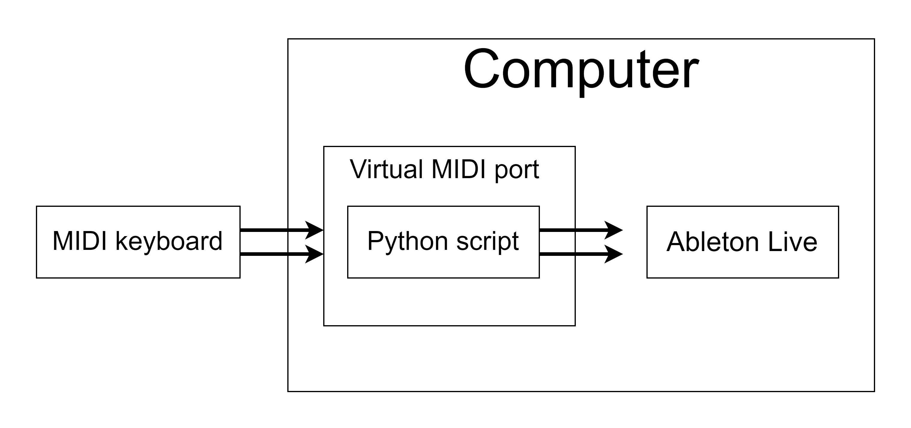

# Matrix MIDI Navigation
Navigate Ableton Live's session view as a 2D array and assosiate specific tracks with specific scenes for super fast navigation (precise skipping). Also includes a script for semi-automatic midi-mapping.

<p align="left">
 
</p>

# Config
### Virtual MIDI Port
You need to create a virtual MIDI port that will sit between the python rtMIDI and your DAW. On Mac, use the IAC Driver and setup a designated IAC bus. On Windows, I recommend using [Tobias Erichsen's loopMIDI](https://www.tobias-erichsen.de/software/loopmidi.html).

<p align="left">
 
</p>

### Config.py
Once the virtual MIDI port is configured, open *config.py* and add the following information:
```
SCENE_CONFIG = {
    1 : [1, 2, 0, 3],
    2 : [2, 0],
    3 : [2, 3, 1, 3]
}

SYNTH_NOTE = 68 #the note number of the button that triggers a new synth.
SCENE_NOTE = 57 #the note number of the button that trigger the next scene.
VOLUME_NOTE = 7 #the note number of the dial that control the volume

LOWPASS_NOTE = 10 #the note number of the dial that control the lowpass filtering
REVERB_NOTE = 11 #the note number of the dial that controls the reverb amount 

START_NOTE = 66 #the note number of the button that toggles start
STOP_NOTE = 65 #the note number of the button that toggles stop

MIDI_CHAN = 176 #the MIDI channel of the buttons of the MIDI-keyboard, not the keys
NOTE_ON = 127 #the note-on MIDI value
NOTE_OFF = 0 #the note-off MIDI value

#to avoid conflict with other MIDI events on the same channel, we offset all the incoming messages to very high values.
#this value defines the highest possible note we can use for triggering events. all our events will occur just below this value.
HIGH_NOTE = 120
```
To see the MIDI values from your own setup, run the *keyboard-test.py*, use your MIDI-keyboard and see the MIDI-values printed on the console. 

The SCENE_CONFIG defines what synths are used in what scene, and in which order. For instance, in scene nr.3 above, we switch from synth nr.2, to 3, to 1, to 3 and back to 2, if we continuously press the button associated with the SYNTH_NOTE value.

### Ableton MIDI Settings
Run the virtual MIDI port and set the following MIDI config in your DAW:
<p align="left">
 
</p>
All midi will come from our virtual MIDI port. 

# How to Use
### MIDI Mapping
To make the midi-mapping part easy, I made a small script that does it automatically based on the information in *config.py*. To do this, simply run your virtual MIDI port, open your DAW in MIDI-mapping-mode, set correct MIDI settings and run *daw-midi-mapping.py*. Then, follow the command-line instructions to correctly setup Ableton.
```
Available MIDI input ports:
0 :  X3mini 0
1 :  virtual_midi_port 1
which port should I get MIDI from?: 0
Receiving MIDI from port:  0


Available MIDI output ports:
0 :  Microsoft GS Wavetable Synth 0
1 :  X3mini 1
2 :  virtual_midi_port 2
which port should I send the MIDI to?: 2
Sending MIDI to port:  2


Toggle scene 1, THEN press y to continue: y
Toggle scene 2, THEN press y to continue: y
Toggle scene 3, THEN press y to continue: y


Toggle synth 0, THEN press y to continue: y
Toggle synth 1, THEN press y to continue: y
Toggle synth 2, THEN press y to continue: y
Toggle synth 3, THEN press y to continue: y


Toggle main volume, THEN press y to continue: y
Toggle Low-pass filter, THEN press y to continue: y
Toggle reverb, THEN press y to continue: y
Toggle start, THEN press y to continue: y
Toggle stop, THEN press y to continue: y


Config fully completed!
```

### Running the program
When everything above is set, run *lets_go.py*. Remember to turn off all the speaker buttons (big yellow) beforehand.

# Requirements
collections.deque and rtmidi
